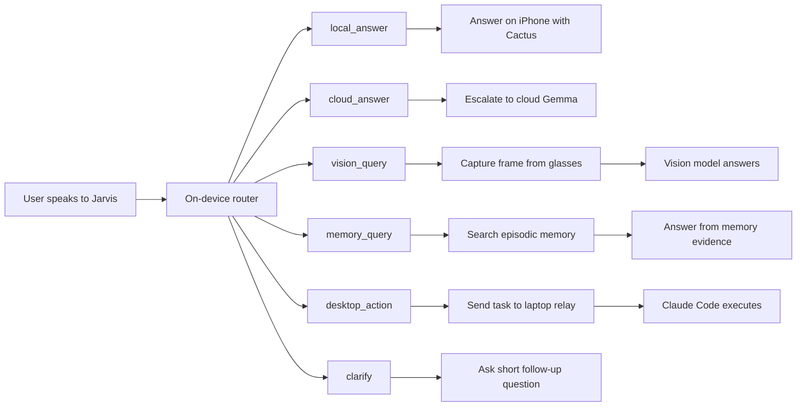
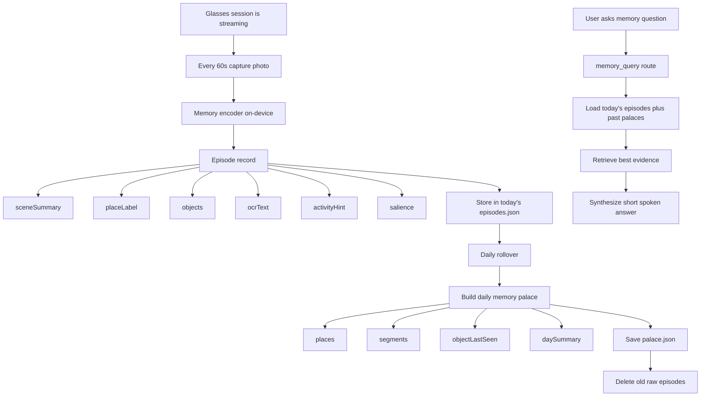
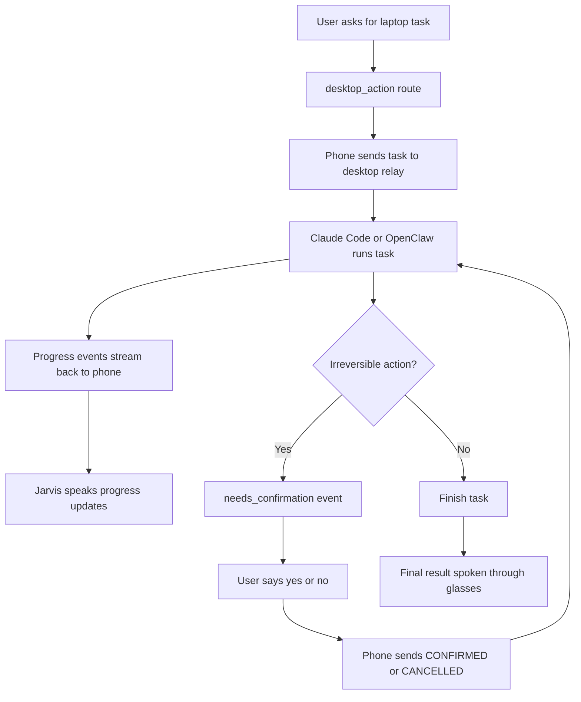

# Jarvis

Jarvis is a voice-first AI assistant for Meta Ray-Ban smart glasses on iOS. The glasses are the input and output surface, the iPhone is the brain, and the laptop is the execution surface for tasks that require a real desktop. Jarvis uses [Cactus](https://github.com/cactus-compute/cactus) for on-device speech and reasoning, escalates harder requests to cloud models when needed, and can dispatch laptop work through a relay.

```
Ray-Ban Glasses (mic + camera + speakers)
                │ Bluetooth
                ▼
             iPhone
  ├── Meta DAT          →  glasses connection + camera frames
  ├── CactusSTT         →  on-device transcription
  ├── CactusLM / Router →  local answers + routing
  ├── Cloud models      →  complex reasoning + vision when needed
  └── Desktop relay     →  laptop actions through Claude Code
```

---

## What Jarvis Is Building Toward

The current prototype already connects to the glasses, captures audio, routes requests, and can answer locally or through cloud services. The intended product experience goes further: a hands-free agent that can understand what you say, see what you see, and put your laptop to work while you stay in motion.

## Who Jarvis Is For Right Now

Jarvis is not trying to be a generic voice assistant for everyone on day one. The clearest first wedge is:

- **Single-user laptop-native power users.** Founders, engineers, operators, PMs, and researchers who already live in email, docs, browser tabs, terminals, and cloud apps.
- **People who keep leaving their desk but still need their computer.** The best moments are walking between meetings, commuting, doing errands, moving around the office, or working with hands occupied while the laptop still matters.
- **Users who get immediate value from delegation.** Jarvis is strongest when it can answer a fast local question, inspect the world, remember something recent, or push a real desktop task forward while you stay in motion.

Jarvis is **not** initially optimized for:

- **A broad consumer assistant replacement.** It is more valuable as a high-agency tool for people with existing laptop workflows than as a Siri competitor.
- **Multi-user family or shared-device scenarios.** The current product assumes one person, one phone, one laptop, and one recent memory stream.
- **Heavy enterprise workflow orchestration.** Regulated multi-seat deployments, admin controls, and organization-wide policy layers are later concerns, not the first ship target.

## Architecture At A Glance

### Request Routing



### Episodic Memory Pipeline



### Desktop Execution And Confirmation



## Key Features

- **Fast on-device answers for simple requests.** Jarvis should handle lightweight questions locally on the phone for speed and privacy.
  Example: `Hey Jarvis, what's the capital of Japan?`

- **Vision on demand instead of constant streaming.** Jarvis only grabs a frame when the prompt actually needs sight, which is better for battery and privacy.
  Example: `Hey Jarvis, what's on my desk?` or `Hey Jarvis, read this sign.`

- **Cloud escalation for harder reasoning.** When a task is too complex for the small on-device model, Jarvis can hand it off to a larger cloud model and still speak the result back through the glasses.
  Example: `Hey Jarvis, compare these two go-to-market strategies and tell me which one is riskier.`

- **Desktop delegation for real work.** Jarvis is meant to route laptop tasks to a relay running on your computer so the assistant can draft emails, search files, and use desktop apps while you're away from your desk.
  Example: `Hey Jarvis, find the email from March about the Harvard acceptance letter and draft a thank-you reply.`

- **Progress updates during long-running tasks.** Instead of going silent, Jarvis should narrate what it's doing while the laptop agent works.
  Example: `Opening Gmail... searching March mail... drafting the reply... done.`

- **Confirmation before irreversible actions.** Jarvis should pause before sending, deleting, paying, or submitting anything important.
  Example: `I've drafted the email and I'm ready to send it. Do you want me to continue?`

- **Clarification when intent is ambiguous.** If the router is not confident, Jarvis should ask one short follow-up instead of guessing.
  Example: `Do you want me to answer that here, or do you want me to do something on your laptop?`

- **Graceful fallback when part of the system is unavailable.** If the laptop is offline or a cloud service is down, Jarvis should keep the rest of the experience usable.
  Example: `Your laptop isn't reachable right now, but I can still answer that locally.`

## Example Product Moments

1. **Environmental awareness**

   You look at a cluttered table and ask: `Hey Jarvis, what am I looking at?`

   Jarvis captures a frame, identifies the scene, and answers through the glasses without you touching your phone.

2. **Desktop execution**

   You are walking between meetings and say: `Hey Jarvis, draft an update email to Patrick about the hackathon build.`

   Jarvis routes the request to the laptop, speaks progress updates, and comes back with a draft ready for review.

3. **Safe action handling**

   You say: `Hey Jarvis, send that email.`

   Jarvis does not send immediately. It stops, summarizes what it is about to do, and asks for confirmation first.

4. **Local-first assistance**

   You ask: `Hey Jarvis, what's the weathering steel called that forms a protective rust layer?`

   Jarvis can answer quickly on-device when the request is simple enough not to need the cloud or your laptop.

---

## Requirements

- iPhone running iOS 15.2+
- Mac running Xcode 14+ (for building and deploying)
- Node 18+
- Meta Ray-Ban glasses with firmware v20+ (Ray-Ban Meta) or v21+ (Display)
- Meta AI app v254+ on your iPhone

> **Xcode runs on your Mac. The app runs on your iPhone.**
> Connect iPhone to Mac via USB cable, select it as the build target in Xcode, and hit Run. Bluetooth is required for glasses connectivity — the iOS Simulator won't work.

---

## 1 — Enable Developer Mode on your glasses

The Meta AI app moved this setting around between versions. Try these in order:

**Option A — Meta AI app (newer versions)**
1. Open the **Meta AI** app on your iPhone
2. Tap **☰ Menu → Devices → [your glasses name]**
3. Scroll to the bottom → tap **About**
4. Tap the **firmware version number 5 times** quickly
5. A toast should say "Developer mode enabled"

**Option B — if you don't see it under Devices**
1. Open **Meta AI** → tap your **profile avatar** (top left)
2. Tap **Settings → Connected devices → [your glasses]**
3. Scroll down to **About** and tap the version number 5 times

**Option C — via the older Meta View app**
If you have the **Meta View** app installed instead:
1. Open **Meta View** → tap **Device → [glasses name]**
2. Tap **More info** → tap the version number 5 times

Once enabled, a **Developer** section or badge should appear in the device settings. You only need to do this once per glasses pairing.

---

## 2 — Register at the Meta Wearables Developer Center

1. Go to [wearables.developer.meta.com](https://wearables.developer.meta.com/) and sign in with your Meta account
2. Create a project — use bundle ID `com.jarvis.app` and platform **iOS**
3. Your credentials are shown on the dashboard — you've already added them to `Secrets.xcconfig`

---

## 3 — Clone and install

```bash
git clone https://github.com/v1hns/jarvis.git
cd jarvis
npm install
```

---

## 4 — iOS setup

### 4a — Create your Secrets.xcconfig

```bash
cp ios/Jarvis/Secrets.xcconfig.example ios/Jarvis/Secrets.xcconfig
```

Fill in `ios/Jarvis/Secrets.xcconfig` with your credentials (already done if you followed initial setup):

```
META_APP_ID = 1487636526490742
META_CLIENT_TOKEN = AR|1487636526490742|...
```

### 4b — Open in Xcode

```bash
cd ios && pod install && cd ..
open ios/Jarvis.xcodeproj
```

### 4c — Attach Secrets.xcconfig to your build configuration

1. In Xcode, click the **Jarvis** project (blue icon, top of file tree)
2. Select the **Project** (not the target) → **Info** tab
3. Under **Configurations**, expand **Debug** and **Release**
4. For each, set the configuration file to **Secrets.xcconfig**

### 4d — Sign the app

1. Select the **Jarvis** target → **Signing & Capabilities**
2. Check **Automatically manage signing**
3. Set your **Team** to your Apple Developer account

### 4e — Add the Meta DAT Swift package

1. **File → Add Package Dependencies…**
2. Paste: `https://github.com/facebook/meta-wearables-dat-ios`
3. Select the latest version and add to the **Jarvis** target

### 4f — Run on your iPhone

1. Plug your iPhone into your Mac via USB
2. Unlock your iPhone and tap **Trust This Computer** if prompted
3. In Xcode, select your iPhone from the device dropdown (top center)
4. Hit **⌘R** to build and run

---

## 5 — Using the app

1. Jarvis downloads on-device AI models on first launch (~200–400 MB) — wait for "Ready"
2. Make sure Bluetooth is on and glasses are on your face / nearby
3. Tap **Scan for Ray-Ban Glasses** — your glasses appear by name within a few seconds
4. Tap them to connect — Jarvis starts listening through the glasses mic
5. Speak naturally. After a short pause Jarvis transcribes and responds
6. Tap **Enable Vision** to stream camera, or **Snap + Ask** to take a photo and ask about it

---

## 6 — Testing without physical glasses

Swap in the MockDevice in `MetaDATModule.swift` to run in Simulator:

```swift
// Add MetaWearablesDAT MockDeviceKit via the same SPM package
// then at the top of MetaDATModule.swift:
import MetaWearablesDATMock

// In register():
MetaWearablesDAT.shared.useMockDevice()
```

---

## 7 — Project structure

```
jarvis/
├── src/
│   ├── App.tsx                     Entry point
│   ├── screens/HomeScreen.tsx      Main UI
│   ├── hooks/useJarvis.ts          Cactus AI + DAT orchestration
│   └── modules/MetaDAT.ts          JS ↔ native bridge
└── ios/
    ├── Jarvis/MetaDATModule.swift  Native module (Meta DAT)
    ├── Jarvis/MetaDATModule.m      Obj-C bridge header
    ├── Jarvis/Info.plist           Permissions & build vars
    ├── Jarvis/Secrets.xcconfig     Your credentials (gitignored)
    ├── Jarvis/Secrets.xcconfig.example  Template
    └── Podfile
```

---

## 8 — Common issues

| Problem | Fix |
|---|---|
| Glasses don't appear in scan | Meta AI app must be open in background on the same iPhone |
| Developer mode option missing | Try Options A / B / C in Step 1 above — UI varies by app version |
| `MetaDATModule not found` | Run `pod install` in `ios/` and rebuild |
| `$(META_APP_ID)` not resolving | Make sure Secrets.xcconfig is attached in Xcode → Project → Info → Configurations |
| Build fails on Simulator | Must run on a physical iPhone — Bluetooth is required |
| Glasses connect but no audio | Re-enable Developer Mode; it can reset after a firmware update |

---

## Useful links

| Resource | URL |
|---|---|
| Meta Wearables Developer Center | https://wearables.developer.meta.com/ |
| Meta DAT iOS SDK | https://github.com/facebook/meta-wearables-dat-ios |
| Meta DAT iOS API reference | https://wearables.developer.meta.com/docs/reference/ios_swift/dat/0.6 |
| Cactus React Native | https://github.com/cactus-compute/cactus-react-native |

---

## License

MIT
